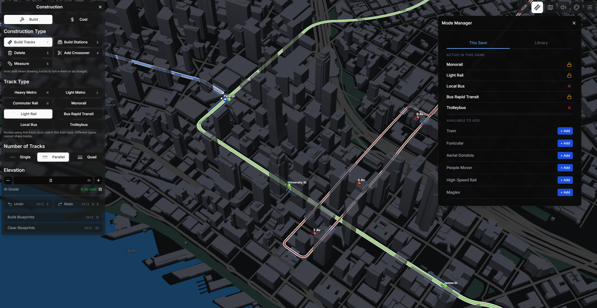
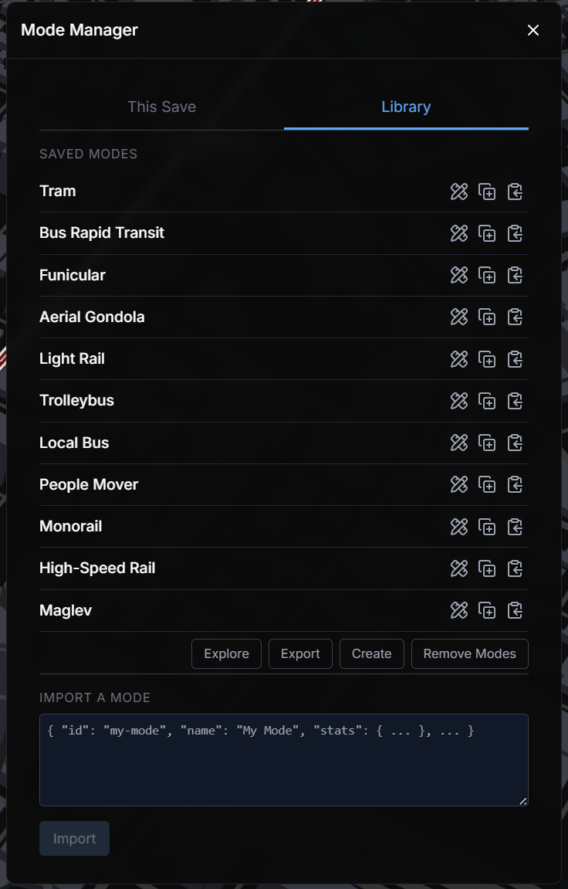
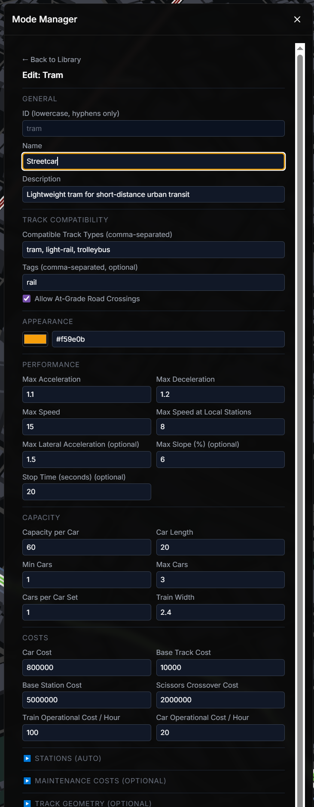

# Mode Manager (Subway Builder Mod)

An all-in-one Subway Builder mod for creating, managing, and editing transit modes without juggling separate mod folders or config files! Easily add busses, trams, monorails, and more! Create your own custom transit modes with an easy UI.

<p align="center">
  
</p>

## Features

<table>
<tr>
<td width="50%" valign="top">

#### 🎮 Curate modes per save

Choose which transit modes are active for each save game — no juggling mod folders or restarting the game between sessions.

</td>
<td width="50%" valign="top">

#### 🔒 Save-safe by design

Modes with placed tracks lock automatically. Each save pins its own copy of every mode definition, so library edits can't break existing game saves.

</td>
</tr>
<tr>
<td width="50%" valign="top">

#### ✏️ Build modes in-game

A form-based editor with auto-computed derived stats (station lengths, deceleration). No raw JSON required — or paste a definition if you have one.

</td>
<td width="50%" valign="top">

#### 🔌 Plays well with others

Detects transit modes registered by other mods so you always see what's available in your current game, not just what Mode Manager controls.

</td>
</tr>
</table>

## Built-in Modes

Eleven transit modes ship as built-ins, spanning neighborhood buses to intercity maglev. Similar modes share track infrastructure where it makes sense — bus modes can use each other's roads, trams can run on light-rail track (and vice versa), and so on. Built-ins are fully customizable and can be removed.

<table>
<tr>
<td width="50%" valign="top">

#### 🚍 Local Bus

Standard city bus for frequent neighborhood service.

**Top speed:** 18 · **Capacity:** 50/car · **Shares tracks:** trolleybus, BRT

</td>
<td width="50%" valign="top">

#### 🚎 Trolleybus

Electric bus drawing power from overhead catenary wires.

**Top speed:** 20 · **Capacity:** 70/car · **Shares tracks:** local bus, BRT

</td>
</tr>
<tr>
<td width="50%" valign="top">

#### 🚌 Bus Rapid Transit

High-capacity bus for dedicated rapid-transit corridors.

**Top speed:** 25 · **Capacity:** 80/car · **Shares tracks:** local bus, trolleybus

</td>
<td width="50%" valign="top">

#### 🚊 Tram

Lightweight tram for short-distance urban transit.

**Top speed:** 15 · **Capacity:** 60/car (1–3 cars) · **Shares tracks:** light rail, trolleybus

</td>
</tr>
<tr>
<td width="50%" valign="top">

#### 🚆 Light Rail

Multi-car light rail for medium-capacity dedicated transit corridors.

**Top speed:** 22 · **Capacity:** 90/car (2–4 cars) · **Shares tracks:** tram

</td>
<td width="50%" valign="top">

#### 🚋 People Mover

Automated people mover for short-distance elevated transit.

**Top speed:** 12 · **Capacity:** 40/car (2–6 cars) · **Elevated**

</td>
</tr>
<tr>
<td width="50%" valign="top">

#### 🚝 Monorail

Elevated monorail for scenic urban and resort transit.

**Top speed:** 30 · **Capacity:** 30/car (4–6 cars) · **Elevated**

</td>
<td width="50%" valign="top">

#### 🚠 Aerial Gondola

Cable-suspended cabins for steep terrain and scenic routes.

**Top speed:** 7 · **Capacity:** 8/car · **Aerial only · max slope 100%**

</td>
</tr>
<tr>
<td width="50%" valign="top">

#### 🚞 Funicular

Inclined railway with counterbalanced cars for steep grades.

**Top speed:** 5 · **Capacity:** 40/car · **Max slope 30%**

</td>
<td width="50%" valign="top">

#### 🚄 High-Speed Rail

Long-distance fast rail for intercity and regional express service.

**Top speed:** 60 · **Capacity:** 80/car (4–10 cars) · **Dedicated ROW**

</td>
</tr>
<tr>
<td width="50%" valign="top">

#### 🚅 Maglev

Magnetic levitation premium intercity transit.

**Top speed:** 80 · **Capacity:** 60/car (2–6 cars) · **Elevated, premium cost**

</td>
<td width="50%" valign="top">

#### ✨ Custom Modes

Don't see what you need? Import any JSON mode definition from the Library tab, or create one from scratch in the in-game editor.

[Browse example mode files →](docs/modes/)

</td>
</tr>
</table>

## Setup

### 1. Get the mod

Clone or download this repo — only the `mode-manager/` folder is required.

```sh
git clone https://github.com/Mpfk/subway-builder-mode-manager.git
```

### 2. Copy it into your mods folder

| Platform | Mods folder |
|---|---|
| Windows | `%APPDATA%\metro-maker4\mods\` |
| macOS | `~/Library/Application Support/metro-maker4/mods/` |
| Linux | `~/.config/metro-maker4/mods/` |

Place the whole `mode-manager/` folder there. The result should be `…/mods/mode-manager/index.js`.

### 3. Enable it in-game

1. Launch Subway Builder
2. Open **Settings → Mods**
3. Toggle **Mode Manager** on
4. Restart the game

Need a deeper walkthrough? See [docs/mod-installation.md](docs/mod-installation.md).

## How to use

Open Mode Manager from the toolbar — the panel has two tabs.

### This Save tab

Shows what's active in the currently-loaded save game.

**Active in this game** — the modes you've committed to this save:

| Icon | Meaning |
|---|---|
| 🔒 | Mode has placed tracks or routes — locked to prevent broken saves |
| ✕ | Mode is committed but nothing's been built yet — click to remove |
| 📦 | Mode is registered by **another mod** (informational, read-only) |

**Available to add** — modes from your library not yet in this save. Click **＋ Add** to commit; the mod hot-reloads so the new track type is immediately available in the game's build panel.

### Library tab

Your mode collection across all saves.

<p align="center">
  
</p>

**Saved Modes** — each row has three icons:

| Icon | Action |
|---|---|
| ✏️ | Open the form editor for this mode |
| ⎘ | Duplicate as a new mode (opens the editor with a copy, blank id) |
| 📋 | Copy this mode's JSON to the clipboard |

Bottom-of-list buttons:

- **Explore** — opens the [community mode catalog](docs/modes/) (also copies the URL as a fallback)
- **Export** — copies your whole library to the clipboard as a JSON array
- **Create** — opens the editor with a blank form
- **Remove Modes** — select modes for deletion

#### Mode editor

Click ✏️ on a saved mode (or **Create** for a new one) to open the mode editor. Required fields sit at the top, optional sections like Track Geometry, Maintenance Costs, and Elevation Multipliers are collapsed at the bottom — leave them blank and sensible defaults are automatically applied for you.

<p align="center">
  
</p>

**Import a Mode** — paste a JSON mode definition and click **Import**. If validation fails or the id conflicts, the editor opens pre-filled with your data and highlights the specific problem inline.

**Available defaults** — built-in modes you previously removed. Click **Restore** to add one back to your library.

## Custom Mode Reference

A mode definition is a JSON object, this means you can share your modes as plain text! See [docs/modes/](docs/modes/) for working examples — every built-in mode ships with a matching `.json` file there.

<details>
<summary><b>Full JSON schema</b></summary>

### Top-level fields

| Field | Type | Required | Notes |
|---|---|---|---|
| `id` | string | Yes | Lowercase letters, numbers, and hyphens only |
| `name` | string | Yes | Display name in the UI |
| `description` | string | Yes | Brief explanation of the mode |
| `stats` | object | Yes | See stats reference below |
| `compatibleTrackTypes` | string[] | Yes | Track type ids this train can run on. List multiple to share infrastructure with other modes |
| `appearance` | object | Yes | Must include `color` (hex string) |
| `allowAtGradeRoadCrossing` | boolean | No | Default `false` |
| `elevationMultipliers` | object | No | Cost multipliers by elevation, e.g. `{"AT_GRADE": 1, "ELEVATED": 4, "CUT_AND_COVER": 6}` |
| `tags` | string[] | No | e.g. `["bus"]`, `["rail"]`, `["aerial"]` |
| `schemaVersion` | string | No | Defaults to `"1.0.0"`; reserved for future schema versions |
| `revision` | integer | No | Auto-bumped when the mode is edited in-game |

### Required stats

`maxAcceleration`, `maxDeceleration`, `maxSpeed`, `maxSpeedLocalStation`, `capacityPerCar`, `carLength`, `minCars`, `maxCars`, `carsPerCarSet`, `carCost`, `trainWidth`, `minStationLength`, `maxStationLength`, `baseTrackCost`, `baseStationCost`, `trainOperationalCostPerHour`, `carOperationalCostPerHour`, `scissorsCrossoverCost`

### Optional stats

Filled with sensible defaults if absent — `stopTimeSeconds`, `maxLateralAcceleration`, `parallelTrackSpacing`, `trackClearance`, `minTurnRadius`, `minStationTurnRadius`, `maxSlopePercentage`, `trackMaintenanceCostPerMeter`, `stationMaintenanceCostPerYear`.

### Auto-computed shortcuts

A few required fields are filled in from others if you leave them blank:

- `minStationLength` = `minCars × carLength`
- `maxStationLength` = `⌈maxCars × carLength × 1.10⌉` — 10% tolerance buffer (rounded up) so the longest train comfortably fits
- `maxDeceleration` = `maxAcceleration + 0.1`

</details>

---

## Contributing

Please [open an issue](../../issues) before submitting changes.

## License

Mode Manager is licensed under [GPL-3.0](LICENSE).

Copyright © 2026 Matt Lydon.
