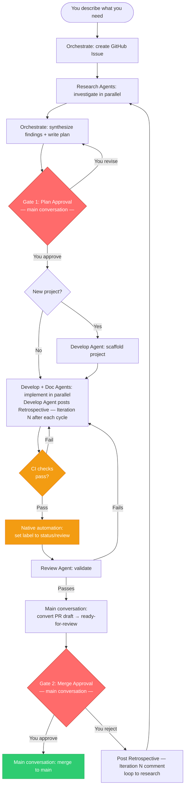
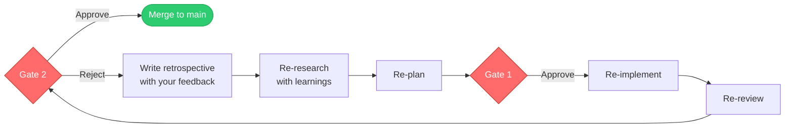
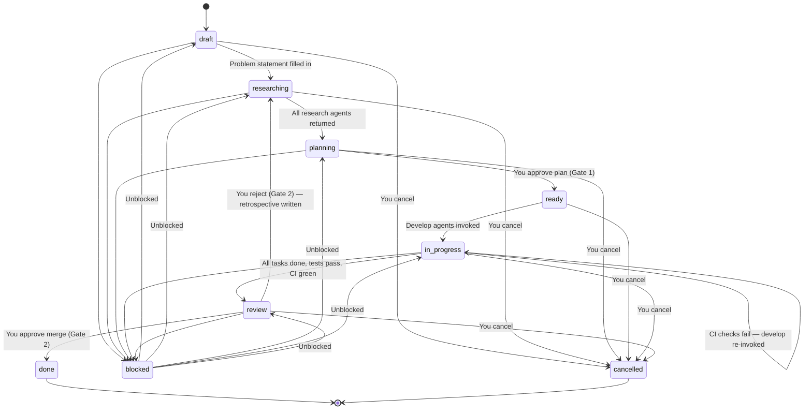
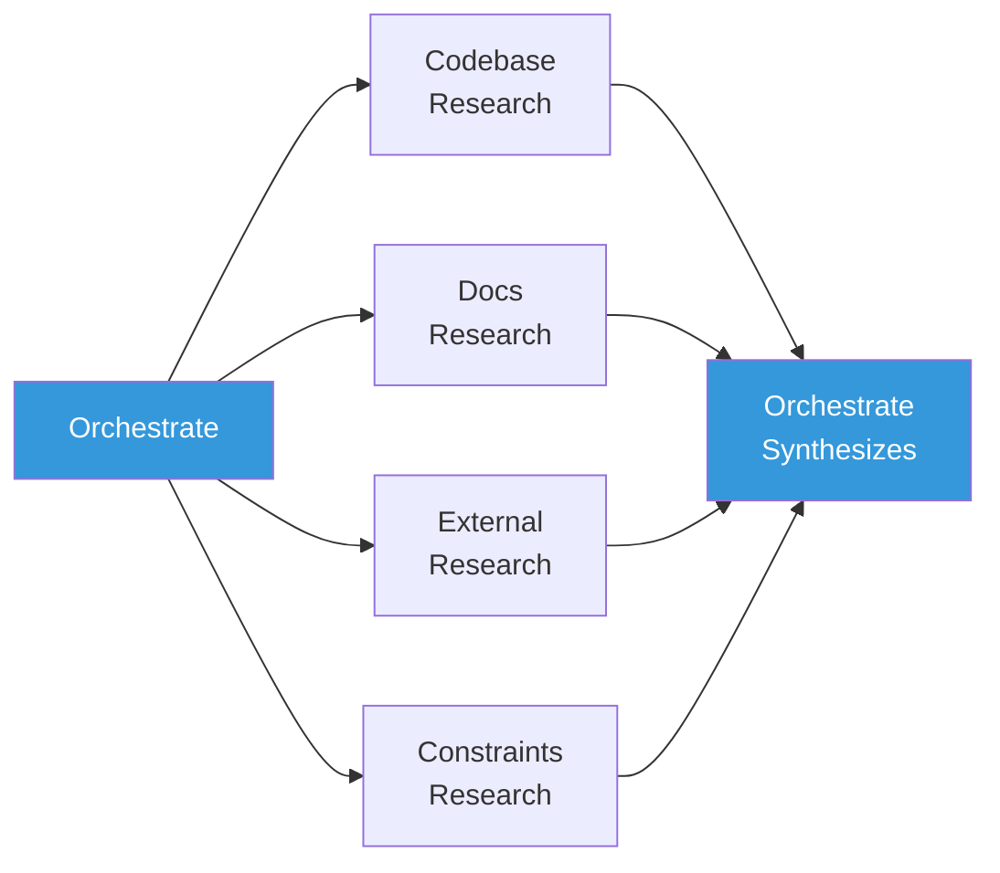
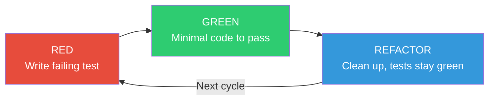

# Agent Flow — Workflow Specification

Auto is a structured software development workflow powered by specialized GitHub Copilot agents. Every piece of work is tracked as a GitHub Issue, developed on its own branch, implemented test-first, and documented before it reaches `main`.

The **main conversation** (you + Copilot) coordinates the workflow. Agents are short-lived workers for specific phases — no single agent runs the entire lifecycle. You stay in control at two gates.

## Execution Modes

**Chat-orchestrated** — the main conversation drives each phase via `@orchestrate` in VS Code.

**GitHub-native** — issue labels, assignees, and PR events drive phase transitions directly on GitHub.

### GitHub-Native Event Triggers

| Trigger | Result |
|---------|--------|
| Issue created with `status/draft` | Issue agent runs intake, research, and planning |
| Plan approved | Issue moves to `status/ready` |
| Copilot assigned to `status/ready` issue | Branch `issue/{number}` created, label → `status/in-progress`, TDD starts |
| PR opened from `issue/{number}` | Issue stays `status/in-progress` |
| CI checks green on draft PR | Label → `status/review`, Review Agent invoked |
| Review Agent returns PASS | PR converted from draft to ready-for-review |
| CI checks fail on PR | Develop Agent re-invoked with failure output and prior retrospective |
| PR merged | Issue → `status/done` and closed |

## Workflow Diagram



## Phase Coordination

| Phase | Who runs it | What happens |
|-------|------------|--------------|
| 1. Init | Orchestrate | Creates GitHub Issue, checks for duplicates |
| 2. Research | Research Agents (parallel) | Investigate codebase, docs, external sources, constraints |
| 3. Synthesize + Plan | Orchestrate | Merges research, writes plan, presents Gate 1 |
| 4. Gate 1 | Main conversation | You approve or revise the plan |
| 5. Implement | Develop + Documentation Agents (parallel) | Feature branch, Red-Green-Refactor, docs updated |
| 6. Review | Review Agent | Validates TDD compliance, quality, tests |
| 7. Gate 2 | Main conversation | You approve merge or reject with feedback |
| 8. Merge | Main conversation | Merges branch, closes issue |

**Parallel rules:**
- Research angles (codebase, docs, external, constraints) run in parallel.
- Develop Agent(s) + Documentation Agent run in parallel during implementation.
- Review is always sequential — implementation must be complete first.

## Approval Gates

### Gate 1 — Plan Approval

**When:** After research is complete and a plan has been drafted.

**You see:** Synthesized research findings, open questions, the proposed plan, acceptance criteria.

**Your options:**
- **Approve** — agents begin implementation
- **Revise** — request changes, answer open questions, adjust scope

### Gate 2 — Merge Approval

**When:** After implementation is complete, tests pass, and the Review Agent has signed off.

**Prerequisites — all three required:**
1. Issue has `status/review` label
2. Review Agent returned PASS
3. CI checks are green on the PR

Only after all three are satisfied does the main conversation convert the PR from draft to ready-for-review and present Gate 2.

**You see:** Review Agent summary, retrospective, diff summary, proposed merge commit message.

**Your options:**
- **Approve** — branch merges to `main`, issue closes with `status/done`
- **Reject** — a `## Retrospective — Iteration N` comment is posted, label resets to `status/researching`, workflow loops back to research



## Issue Lifecycle

### Status Labels

| Label | What's happening |
|-------|-----------------|
| `status/draft` | Issue created, problem described |
| `status/researching` | Research Agents investigating |
| `status/planning` | Research done, plan being written |
| `status/ready` | Plan approved, ready for implementation |
| `status/in-progress` | Code being written via TDD |
| `status/review` | Implementation done, being validated |
| `status/done` | Merged to `main`, issue closed |
| `status/blocked` | Waiting on external input or your decision |
| `status/cancelled` | Abandoned by your decision |

Issues also carry a type label: `bug`, `feature`, `refactor`, `docs`, `test`, `chore`.

### State Machine



### Issue Structure

Issues use a structured body template (enforced via `.github/ISSUE_TEMPLATE/workflow-issue.yml`):

```markdown
## Problem Statement
## Description
## Research
### Key Findings
### Constraints
### Open Questions
## Plan
## Acceptance Criteria
```

Branches follow the naming convention `issue/{issue-number}` (e.g. `issue/42`).

## Agents

### Issue Agent

Handles GitHub-native intake and planning when work starts from an issue.

- Validates issue structure, runs duplicate checks, runs parallel research, synthesizes into plan + acceptance criteria, prepares Gate 1 material.
- Does **not** implement, run Gate 2, or merge.

**Config:** `.github/agents/issue.agent.md` | Model: Claude Opus 4

### Orchestrate Agent

Entry point for VS Code chat-driven mode. Handles Phases 1–3.

- Checks for duplicate issues, creates GitHub Issue, selects and invokes Research Agents, synthesizes findings, writes the plan, presents Gate 1.
- Does **not** implement, review, run Gate 2, or merge.

**Config:** `.github/agents/orchestrate.agent.md`

### Research Agent

Investigates one angle per invocation. Invoked 2–4 in parallel. Read-only (~10 tool calls per invocation).



| Strategy | Investigates | Sources |
|----------|-------------|---------|
| **Codebase** | Existing patterns, data flows, test gaps | Source files, tests |
| **Docs** | Documented decisions, past issues | `docs/`, ADRs, GitHub Issues |
| **External** | Industry patterns, candidate libraries | Web search, library docs |
| **Constraints** | Security, performance, compatibility | OWASP, API contracts |

**Config:** `.github/agents/research.agent.md` | Model: Claude Sonnet 4 | Cannot modify files.

### Develop Agent

Implements one component via strict Red-Green-Refactor (~15–20 tool calls per invocation). For multiple components, invoke multiple Develop Agents.



1. **RED** — Write a failing test. Commit: `test: ... [RED]`
2. **GREEN** — Minimal code to pass. Commit: `feat: ... [GREEN]`
3. **REFACTOR** — Clean up; tests stay green. Commit: `refactor: ... [REFACTOR]`

After each cycle, the agent posts a `## Retrospective — Iteration N` comment to the issue (and PR if one exists). For new projects with no build tool, scaffold first with `chore(scaffold): ...` before beginning RED-GREEN-REFACTOR.

**Config:** `.github/agents/develop.agent.md`

### Documentation Agent

Maintains all documentation in `docs/`. Invoked in parallel with Develop Agents (~10–15 tool calls).

- Updates `docs/api/` for API changes, creates ADRs in `docs/decisions/` for significant choices, updates `README.md` for new setup steps.
- Enforces the no-docs-outside-`docs/` rule.

**Config:** `.github/agents/documentation.agent.md` | Model: Claude Sonnet 4

### Review Agent

Pre-merge quality gate. Read-only (~15–20 tool calls). Invoked only after CI is green on the draft PR.

**Checks:** Conventional Commits format, TDD sequence (RED before GREEN in git log), code quality, test quality, docs updated, full test suite passes.

**Output:** PASS (ready for Gate 2) or FAIL (specific issues listed).

**Config:** `.github/agents/review.agent.md` | Model: Claude Opus 4 | Cannot modify files.

## Configuration

### `workflow.conf`

All git hooks source this file. Auto-detected on first use; edit manually only if needed.

```bash
TEST_CMD="npm test"        # Your test command (pytest, go test ./..., cargo test, etc.)
SRC_DIRS="src/ lib/"       # Where implementation code lives
TEST_DIRS="tests/ test/"   # Where test files live
MAIN_BRANCH="main"
```

### `.github/hooks/doc-freshness.json`

A Copilot PostToolUse hook. After file edits, reminds the agent to check whether `docs/` needs updating. Advisory only.

### `.github/workflows/`

- **`conventional-commits.yml`** — Validates PR commit messages on every PR.
- **`test-suite.yml`** — Runs full test suite (from `workflow.conf`) on every PR.

## Git Hooks

Activated by: `git config core.hooksPath .githooks`

Uses a **dispatcher pattern** — each hook type runs all scripts in its `.d/` subdirectory, keeping rules modular.

### Pre-Commit

| Hook | Enforces |
|------|----------|
| Branch Guard | Blocks direct commits to `main` |
| Doc Placement Guard | Blocks new `.md` files outside `docs/` (except `README.md` and `.github/`) |
| TDD Cycle Guard | On issue branches, blocks source-only commits if no test commits exist yet |

### Commit-Msg

| Hook | Enforces |
|------|----------|
| Conventional Commits | Rejects messages not matching `type(scope): description` |
| Issue Linkage | Auto-appends `Closes #{number}` to commits on `issue/*` branches |

### Pre-Push

| Hook | Enforces |
|------|----------|
| Issue Status Consistency | Verifies the GitHub Issue exists and has at least `status/in-progress` |
| Test Suite Gate | Runs the full test suite; broken code never leaves the local branch |

### Post-Commit

| Hook | Does |
|------|------|
| Doc Freshness Check | Prints a reminder to update `docs/` when source files change. Advisory only. |

## Conventional Commits

```
type(scope): description

[optional body]

Closes #42
```

| Type | When to use | TDD Phase |
|------|-------------|----------|
| `test` | Adding or updating tests | RED |
| `feat` | New feature implementation | GREEN |
| `fix` | Bug fix | GREEN |
| `refactor` | Restructuring, no behavior change | REFACTOR |
| `docs` | Documentation changes | — |
| `chore` | Build, CI, tooling changes | — |
